# Fair Markets NY — Data Model

This diagram shows every data entity in the platform, the geographic keys that join them, and the aggregation pipeline from raw Census data to page-level views.

## Entity Relationship Diagram

```mermaid
erDiagram
    %% ─── Geographic Hierarchy ───────────────────────────────────

    CensusTract {
        string geoid PK "11-digit FIPS (e.g. 36047049900)"
        string countyFips
        string countyName
        string tract
    }

    NTA {
        string ntaCode PK "e.g. BK0101"
        string ntaName
        string ntaAbbrev
        string boroCode
        string boroName
        string countyFips
        string cdta
    }

    Neighborhood {
        string slug PK "URL-safe name"
        string name
        string borough
        string fips
        string ntaVersion
        string[] ntaCodes "1-to-many NTAs"
        string[] ntaNames
    }

    Borough {
        string borough PK
        int boroCode
        string county
        string fips "5-digit county FIPS"
    }

    County {
        string fips PK "5-digit FIPS"
        string name
        string nycBorough "nullable, NYC only"
    }

    HealthRegion {
        string slug PK "e.g. nyc-metro"
        string name
    }

    %% Geographic crosswalk relationships
    CensusTract }|--|| NTA : "nta-to-census-tract.json"
    NTA }|--|| Neighborhood : "neighborhood-to-nta.json"
    Neighborhood }|--|| Borough : "borough"
    Borough ||--|| County : "borough-county-fips.json"
    County }|--|| HealthRegion : "healthcare-region-counties.json"

    %% ─── Housing Domain ─────────────────────────────────────────

    HousingNeighborhood {
        string slug PK
        string name
        string borough
        string fips
        string[] ntaCodes
        int totalUnits
        int hhi
        float cr4
        float hpdViolationsPerUnit
        int medianRent "ACS 2024"
        int medianIncome "ACS 2024"
        float rentBurdenPct "ACS 2024"
        float rentGrowthPct "merged from rent-history"
        int nychaUnits
        float nychaShare
        int universityUnits
        float universityShare
        int stabilizedUnits
        float stabilizedShare
    }

    TopLandlord {
        string name
        int units
        float share
    }

    RentHistory {
        string ntaCode
        string slug PK
        string name
        string borough
        float rentGrowthPct "2019 to 2024"
    }

    RentHistoryEntry {
        int year "2019, 2023, 2024"
        int medianRent
    }

    HousingTimeSeries {
        string sector "Housing"
        string geography "New York City"
    }

    HousingTimeSeriesYear {
        int year "2015-2024"
        int hhi
        float cr4
    }

    HousingMarketShare {
        string company
        float share
        string source
    }

    HousingNeighborhood ||--|{ TopLandlord : "topLandlords[]"
    HousingNeighborhood ||--o| RentHistory : "joined by slug"
    RentHistory ||--|{ RentHistoryEntry : "rentHistory[]"
    HousingTimeSeries ||--|{ HousingTimeSeriesYear : "years[]"
    Neighborhood ||--|| HousingNeighborhood : "slug"

    %% ─── Broadband Domain ───────────────────────────────────────

    BroadbandCounty {
        string slug PK
        string name
        string fips
        int totalHouseholds
        int providersAt100Mbps
        int hhi
        float cr4
        float zeroPctBlocks "pct with 0 providers"
        float onePctBlocks "pct with 1 provider"
        int cheapest100Mbps "nullable, $/mo"
        string cheapest100Provider "nullable"
    }

    BroadbandProvider {
        string name
        float share
        int maxDownload
    }

    BroadbandPricing {
        string providerName PK
        int cheapest100 "$/mo at 100+ Mbps"
        string planName
        int speed "Mbps download"
        boolean introRate
        int regularPrice "nullable"
        string equipment
        string sourceUrl
    }

    BroadbandPricingMeta {
        string source "ISP published rate cards"
        string accessed "2026-02-14"
        int fccBenchmarkYear
        float fccUrbanAvgMonthly
    }

    BroadbandTimeSeries {
        string sector "Broadband"
        string geography "New York State"
    }

    BroadbandTimeSeriesYear {
        int year "2015-2024"
        int hhi
        float cr4
    }

    BroadbandMarketShare {
        string company
        float share
        string source
    }

    NYCMeshNodes {
        int activeNodes
        int supernodes
        int hubs
    }

    NYCMeshBorough {
        string borough
        string slug
        int activeNodes
        int supernodes
        int hubs
    }

    BroadbandCounty ||--|{ BroadbandProvider : "topProviders[]"
    BroadbandCounty }|--o| BroadbandPricing : "cheapest100Provider"
    BroadbandPricingMeta ||--|{ BroadbandPricing : "providers{}"
    BroadbandTimeSeries ||--|{ BroadbandTimeSeriesYear : "years[]"
    County ||--|| BroadbandCounty : "fips"
    NYCMeshNodes ||--|{ NYCMeshBorough : "boroughs[]"

    %% ─── Healthcare Domain ──────────────────────────────────────

    HealthcareRegion {
        string slug PK
        string name
        int totalBeds
        int totalFacilities
        int hhi
        float cr4
    }

    HealthSystem {
        string name
        int beds
        int facilities
        float share
    }

    HealthcareTimeSeries {
        string sector "Healthcare"
        string geography "New York State"
    }

    HealthcareTimeSeriesYear {
        int year "2015-2024"
        int hhi
        float cr4
    }

    HealthcareMarketShare {
        string company
        float share
        string source
    }

    HospitalCrosswalk {
        string pfi PK "SPARCS facility ID"
        string facilityName
        string system "health system or Independent"
        string county
        string regionSlug
    }

    ProcedurePricing {
        string drgCode PK "e.g. 560"
        string drgDescription
        string type "Surgical or Medical"
        int statewideMeanCharge
        int statewideMeanCost
        int totalDischarges
        int hospitalCount
    }

    RegionProcedurePricing {
        string regionSlug
        int meanCharge
        int meanCost
        int discharges
    }

    HospitalProcedurePricing {
        string pfi
        string name
        string system
        int meanCharge
        int medianCharge
        int meanCost
        int medianCost
        int discharges
    }

    HealthcareRegion ||--|{ HealthSystem : "topSystems[]"
    HealthcareTimeSeries ||--|{ HealthcareTimeSeriesYear : "years[]"
    HealthRegion ||--|| HealthcareRegion : "slug"
    HospitalCrosswalk }|--|| HealthRegion : "regionSlug"
    ProcedurePricing ||--|{ RegionProcedurePricing : "byRegion[]"
    RegionProcedurePricing ||--|{ HospitalProcedurePricing : "hospitals[]"
    HospitalProcedurePricing }|--|| HospitalCrosswalk : "pfi"

    %% ─── Transportation Domain ──────────────────────────────────

    TransportNeighborhood {
        string slug PK
        string name
        string borough
        string[] ntaCodes
        int workers
        float transitPct
        float drovePct
        float carpoolPct
        float walkBikePct
        float wfhPct
        float zeroCarPct
        float avgCommuteMins
        int medianIncome
        int estMonthlyCost
    }

    MTAFare {
        int year PK "2003-2026"
        string effectiveDate
        float baseFare
        float monthlyPass
        float baseFareReal2024 "inflation-adjusted"
        float monthlyPassReal2024
        string notes
    }

    Neighborhood ||--|| TransportNeighborhood : "slug"

    %% ─── Spending / Homepage ────────────────────────────────────

    HouseholdSpending {
        string geography "NY Metro MSA or US National"
        string table
        string period
        int totalExpenditure
        int meanIncomeBefore
    }

    SpendingCategory {
        string name
        int amount
        boolean tracked
        boolean coming "roadmap item"
        string href "nullable"
    }

    HouseholdSpending ||--|{ SpendingCategory : "categories[]"

    %% ─── Raw Census Data (inputs to aggregation) ───────────────

    ACSIncomeTract {
        string geoid PK
        string countyFips
        int medianIncome
        int moe
        int totalHouseholds
        int medianRent
        int renterHouseholds
        int rentBurdened30to35
        int rentBurdened35to40
        int rentBurdened40to50
        int rentBurdened50plus
    }

    ACSRentTract {
        string geoid PK
        string countyFips
        int medianRent
        int renterHouseholds
    }

    ACSCommuteTract {
        string geoid PK
        string countyFips
        int totalWorkers
        int transitWorkers
        int droveAlone
        int carpooled
        int bicycle
        int walked
        int wfh
        int aggTravelTime
    }

    CensusTract ||--o| ACSIncomeTract : "geoid"
    CensusTract ||--o| ACSRentTract : "geoid (per vintage)"
    CensusTract ||--o| ACSCommuteTract : "geoid"
```

## Data Aggregation Pipeline

```mermaid
flowchart TB
    subgraph sources["External Data Sources"]
        census["Census ACS API<br/><i>B19013, B25064, B25070, B08301</i>"]
        pluto["NYC MapPLUTO 24v4"]
        acris["ACRIS Ownership Records"]
        hpd["HPD Violations"]
        fcc["FCC Broadband Data Collection"]
        doh["NYS DOH SPARCS + AHA"]
        mta["MTA Board Resolutions"]
        bls["BLS Consumer Expenditure Survey"]
        mesh["NYC Mesh API"]
        isp_rates["ISP Published Rate Cards"]
    end

    subgraph raw["data/raw/ (gitignored)"]
        acs_income["acs-income-tracts-2024.json<br/><i>2,327 tracts × income/rent/burden</i>"]
        acs_rent19["acs-rent-tracts-2019.json"]
        acs_rent23["acs-rent-tracts-2023.json"]
        acs_rent24["acs-rent-tracts-2024.json"]
        acs_commute["acs-commute-tracts-2023.json"]
        pluto_raw["pluto-residential.json"]
        hpd_raw["hpd-violations.json"]
        sparcs_raw["sparcs-hospital-costs.json<br/><i>24,846 records × 6 DRGs</i>"]
    end

    subgraph crosswalks["data/crosswalks/"]
        xw_tract["nta-to-census-tract.json<br/><i>geoid → ntaCode</i>"]
        xw_nta["neighborhood-to-nta.json<br/><i>slug → ntaCodes[]</i>"]
        xw_boro["borough-county-fips.json<br/><i>borough → fips</i>"]
        xw_health["healthcare-region-counties.json<br/><i>fips → regionSlug</i>"]
        xw_hospital["hospital-to-system.json<br/><i>pfi → system + regionSlug</i>"]
    end

    subgraph scripts["scripts/scrapers/"]
        dl_income["download-acs-income.ts"]
        dl_rent["download-acs-rent-history.ts"]
        dl_sparcs["download-sparcs-pricing.ts"]
        agg_pluto["aggregate-pluto-ownership.ts"]
        agg_rent["aggregate-nta-rent-history.ts"]
        agg_income["aggregate-nta-income.ts"]
        agg_commute["aggregate-nta-commute.ts"]
        agg_sparcs["aggregate-sparcs-pricing.ts"]
    end

    subgraph output["data/concentration/ (committed)"]
        housing_n["housing-neighborhoods.json<br/><i>197 neighborhoods</i>"]
        rent_hist["rent-history-neighborhoods.json<br/><i>197 neighborhoods × 3 vintages</i>"]
        transport_n["transportation-neighborhoods.json<br/><i>~190 neighborhoods</i>"]
        broadband_c["broadband-counties.json<br/><i>62 counties + pricing</i>"]
        broadband_p["broadband-pricing.json<br/><i>9 providers</i>"]
        health_r["healthcare-regions.json<br/><i>10 regions</i>"]
        health_pricing["healthcare-pricing.json<br/><i>6 procedures × 10 regions</i>"]
        spending["household-spending.json<br/><i>2 geographies</i>"]
        mta_fares["mta-fares.json<br/><i>2003–2026</i>"]
        nycmesh["nycmesh-nodes.json"]
        housing_ts["housing-nyc.json + market-shares"]
        broadband_ts["broadband-nys.json + market-shares"]
        health_ts["healthcare-nys.json + market-shares"]
    end

    subgraph pages["Next.js Pages"]
        p_home["/ Homepage"]
        p_housing["/housing"]
        p_hood["/housing/[neighborhood]"]
        p_broadband["/broadband"]
        p_county["/broadband/[county]"]
        p_health["/healthcare"]
        p_region["/healthcare/[region]"]
        p_transport["/transportation"]
    end

    %% Download flows
    census --> dl_income --> acs_income
    census --> dl_rent --> acs_rent19 & acs_rent23 & acs_rent24
    census --> acs_commute
    pluto --> pluto_raw
    hpd --> hpd_raw

    %% Aggregation flows
    acs_income --> agg_pluto
    pluto_raw --> agg_pluto
    hpd_raw --> agg_pluto
    xw_tract --> agg_pluto
    xw_nta --> agg_pluto
    agg_pluto --> housing_n

    acs_rent19 --> agg_rent
    acs_rent23 --> agg_rent
    acs_rent24 --> agg_rent
    xw_tract --> agg_rent
    agg_rent --> rent_hist

    acs_income --> agg_income
    xw_tract --> agg_income

    acs_commute --> agg_commute
    xw_tract --> agg_commute
    xw_nta --> agg_commute
    agg_commute --> transport_n

    fcc --> broadband_c
    isp_rates --> broadband_p
    isp_rates --> broadband_c
    doh --> dl_sparcs --> sparcs_raw
    sparcs_raw --> agg_sparcs
    xw_hospital --> agg_sparcs
    agg_sparcs --> health_pricing
    doh --> health_r
    mta --> mta_fares
    bls --> spending
    mesh --> nycmesh

    %% Page data imports
    housing_n --> p_housing
    rent_hist --> p_housing
    housing_ts --> p_housing
    housing_n --> p_hood
    rent_hist --> p_hood

    broadband_c --> p_broadband
    broadband_ts --> p_broadband
    nycmesh --> p_broadband
    broadband_c --> p_county
    broadband_p --> p_county

    health_r --> p_health
    health_pricing --> p_health
    health_ts --> p_health
    health_r --> p_region
    health_pricing --> p_region

    transport_n --> p_transport
    mta_fares --> p_transport

    spending --> p_home
    housing_n --> p_home

    %% Styling
    classDef source fill:#E8F5E9,stroke:#2E7D32
    classDef raw fill:#FFF3E0,stroke:#E65100
    classDef crosswalk fill:#E3F2FD,stroke:#1565C0
    classDef script fill:#F3E5F5,stroke:#6A1B9A
    classDef output fill:#E0F2F1,stroke:#00695C
    classDef page fill:#FCE4EC,stroke:#AD1457

    class census,pluto,acris,hpd,fcc,doh,mta,bls,mesh,isp_rates source
    class acs_income,acs_rent19,acs_rent23,acs_rent24,acs_commute,pluto_raw,hpd_raw,sparcs_raw raw
    class xw_tract,xw_nta,xw_boro,xw_health,xw_hospital crosswalk
    class dl_income,dl_rent,dl_sparcs,agg_pluto,agg_rent,agg_income,agg_commute,agg_sparcs script
    class housing_n,rent_hist,transport_n,broadband_c,broadband_p,health_r,health_pricing,spending,mta_fares,nycmesh,housing_ts,broadband_ts,health_ts output
    class p_home,p_housing,p_hood,p_broadband,p_county,p_health,p_region,p_transport page
```

## Geographic Key Reference

| Key | Format | Example | Used By |
|-----|--------|---------|---------|
| `geoid` | 11-digit Census tract | `36047049900` | Raw ACS data, crosswalks |
| `ntaCode` | DCP NTA code | `BK0101` | Tract→neighborhood aggregation |
| `slug` | URL-safe name | `greenpoint` | All neighborhood-level data, page routing |
| `fips` | 5-digit county FIPS | `36047` | County-level data, borough↔county mapping |
| `regionSlug` | Kebab-case region | `nyc-metro` | Healthcare regions |
| `borough` | Proper name | `Brooklyn` | NYC borough aggregation |

## Geographic Boundary Files

Map rendering uses TopoJSON files in `public/geo/`, built from GeoJSON or shapefiles via `scripts/geo/build-boundaries.ts`.

| File | Features | Source | Join Key |
|------|----------|--------|----------|
| `nys-counties.topojson` | 62 counties | Census TIGER 2023 CB 500k | `GEOID` (5-digit FIPS) |
| `nyc-boroughs.topojson` | 5 boroughs | DCP borough boundaries | `GEOID` (county FIPS) |
| `nyc-ntas.topojson` | ~197 NTAs | DCP NTA 2020 boundaries | `GEOID` (NTA code) |
| `nyc-census-tracts.topojson` | ~2,100 tracts | Census TIGER | `GEOID` (11-digit) |

### Topology requirements

TopoJSON files **must** have shared arcs between adjacent features. Without shared arcs, SVG rendering produces visible gaps between polygons — even with thin strokes.

- **Good source**: Census TIGER cartographic boundary shapefiles (`.shp`). These are topologically derived, so adjacent counties/tracts share exact boundary coordinates. Use `mapshaper` to filter and convert: `npx mapshaper input.shp -filter 'STATEFP === "36"' -simplify 50% keep-shapes -rename-layers counties -o format=topojson output.topojson`
- **Bad source**: Independently simplified GeoJSON (e.g., from APIs that return per-feature geometry). Adjacent features will have slightly different coordinates at shared boundaries, and `topojson.topology()` won't detect them as shared arcs — even with quantization.
- **Diagnostic**: Check shared arc percentage. 60%+ shared arcs = good topology. <30% = boundaries are independently digitized and the map will have gaps.
- **Quantization**: Pass `1e5` as the second argument to `topojson.topology()` in `build-boundaries.ts` to quantize coordinates and reduce file size. This helps with size but does not fix topology if the source geometry lacks shared boundaries.

### Rendering pipeline

`ChoroplethMap.tsx` (shared component) → `useTopoJson` hook (fetch + ring rewind) → d3-geo `geoMercator` projection → SVG `<path>` elements. The `useTopoJson` hook rewinds polygon rings after TopoJSON→GeoJSON conversion to fix d3-geo's spherical winding interpretation.

Boundary files join to data through the same FIPS/GEOID keys used in the crosswalk files. For example, `nys-counties.topojson` features have `GEOID: "36047"`, which matches `fips` in `healthcare-region-counties.json`, which maps to `regionSlug` in `healthcare-regions.json`.

## Data Sources

| Domain | Source | API | Vintage |
|--------|--------|-----|---------|
| Housing ownership | NYC MapPLUTO + ACRIS | Socrata | 24v4 |
| Housing violations | HPD via NYC Open Data | Socrata | Rolling |
| Income & rent burden | Census ACS 5-Year | REST | 2020–2024 |
| Rent history | Census ACS 5-Year (B25064) | REST | 2019, 2023, 2024 |
| Commute patterns | Census ACS 5-Year (B08301) | REST | 2019–2023 |
| Broadband availability | FCC BDC | REST | Dec 2024 |
| Broadband pricing | ISP published rate cards | Manual | Feb 2026 |
| Healthcare facilities | NYS DOH SPARCS + AHA | Bulk download | 2024 |
| Hospital pricing | NYS DOH SPARCS Cost Transparency | Socrata API | 2009–2021 |
| Transit fares | MTA Board Resolutions | Manual | 2003–2026 |
| Household spending | BLS CEX | Bulk download | 2023–2024 avg |
| Community broadband | NYC Mesh | Web scrape | Feb 2026 |
